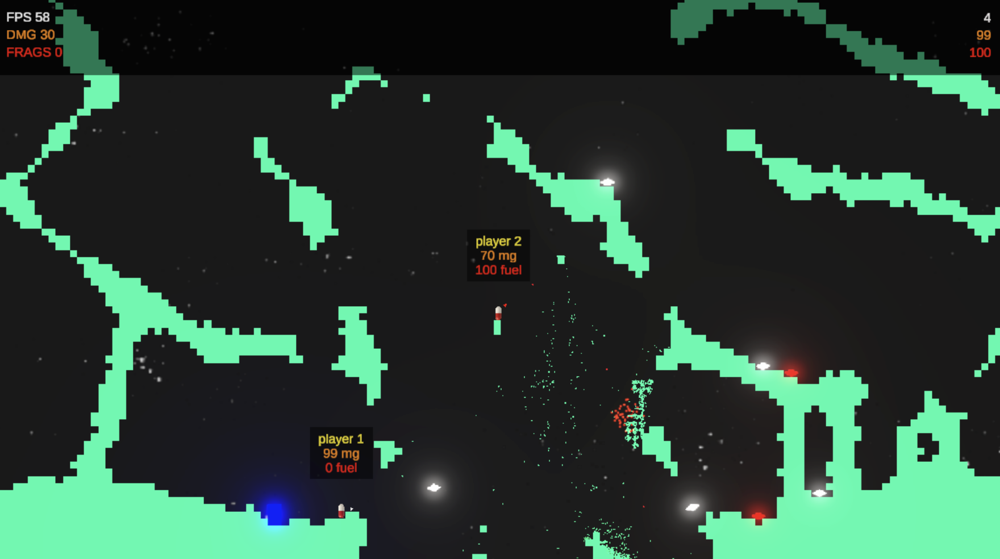

# Pillz



## Running the Server

1. **Install SpaceTimeDB CLI:**
   ```sh
    curl -sSf https://install.spacetimedb.com | sh   
   ```
   
2. **Start SpaceTimeDB:**
    ```sh
    spacetimedb start
    ```

3. **Generate C# bindings for the client:**
   ```sh
   ./generate.sh
   ```

4. **Publish the server locally:**
   ```sh
   ./publish.sh
   ```

5. **View server logs:**
   ```sh
   ./logs.sh
   ```

6. **(Optional) Expose the server via ngrok:**
   ```sh
   ./ngrok.sh
   ```

## Running the Unity Client

1. Open the `client` folder in Unity Editor.
2. Ensure the generated scripts are present in `client/Assets/Scripts/autogen`.
3. Press Play in Unity to start the client.

## Requirements

- Rust and Cargo installed for server development.
- Unity Editor for client development.
- Ngrok (optional) for public server access.
.

## Player Controls

| Action            | Default Binding    | Description                     |
|-------------------|--------------------|---------------------------------|
| Move              | WASD / Arrow Keys  | Move the player                 |
| Jump              | Space              | Hold to jump / throttle jetpack |
| Jetpack           | Shift              | Toggle jetpack                  |
| Stim              | Right Mouse Button | Use stim (only if under 100 mg) |
| Primary Weapon    | 1                  | Select primary weapon           |
| Secondary Weapon  | 2                  | Select secondary weapon         |
| Aim               | Mouse Movement     | Aim weapon direction            |
| Attack    | Left Mouse Button  | Hold and release to shoot       |

## Notes

- Controls are managed via the `PlayerInputActions` asset.
- Weapon aiming uses mouse position.
- Holding and releasing the attack button affects projectile speed.
- Key bindings may be customized in Unity's Input System settings.
